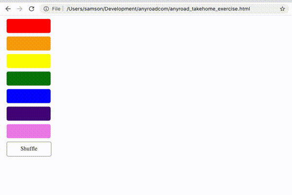

### AnyRoad Take-Home Exercise

Thanks for your interest in joining the AnyRoad team! As part of our hiring process you might have been asked to complete this take-home exercise, which involves building a simple HTML page that contains some CSS and Javascript to render a list of colorful buttons. The goal of the exercise is to test your comfort using simple CSS and Javascript to build web components to a design spec. On our team we leverage common tools like SCSS, Babel, and React to build web UIs, but still need to fall back to plain Javascript from time to time!

This exercise should only take around an hour, so please don't feel pressure to spend more time than that. For reference, our solution is less than 60 lines of code in total. Feel free to be creative and search the web as necessary. And if you'd like to use any frameworks such as React you are welcome to do so, but the only requirement of the exercise is to submit an html file that implements the behaviors below.

### Exercise instructions

- Build a webpage that displays a vertical list of seven rounded buttons with the colors of the rainbow.
- Underneath the list, add a white button that says "Shuffle".
- Clicking the shuffle button should randomize the order of the colored buttons.

#### Here's the list of styling rules for the buttons, and a GIF of about how the final result should look.

- Margin between buttons: 10px
- Button border radius: 5px
- Button height: 40px
- Button width: 120px
- Shuffle button border color: #333
- Shuffle button text color: #333

